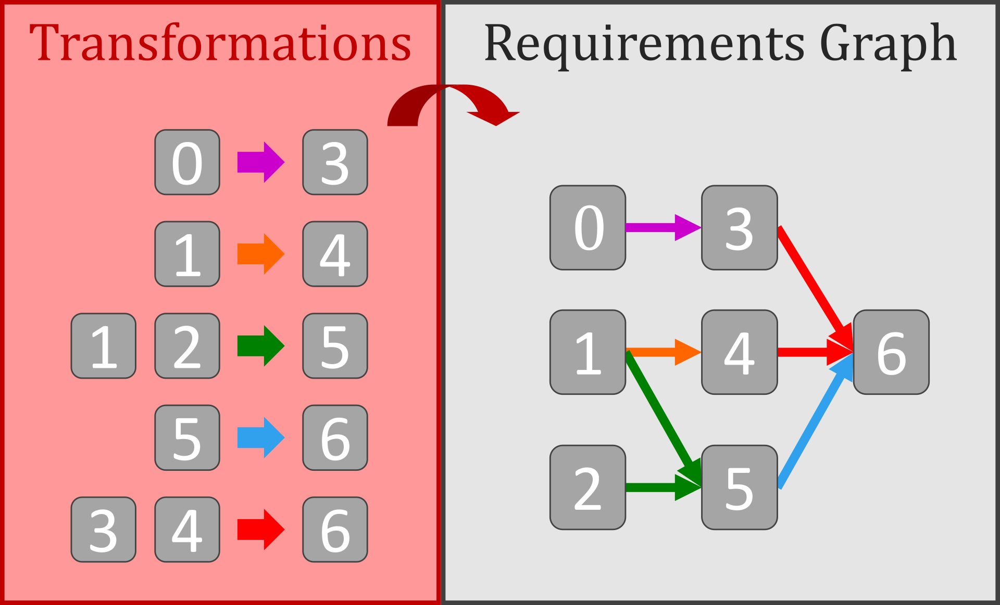

# **HierarchyCraft - Environements builder for hierarchical reasoning research**

[](https://badge.fury.io/py/hcraft)
[](https://pepy.tech/project/hcraft)
[](https://pepy.tech/project/hcraft)
[](https://www.gnu.org/licenses/)

[](https://www.codacy.com/gh/IRLL/HierarchyCraft/dashboard?utm_source=github.com&amp;utm_medium=referral&amp;utm_content=IRLL/HierarchyCraft&amp;utm_campaign=Badge_Grade)
[](https://www.codacy.com/gh/IRLL/HierarchyCraft/dashboard?utm_source=github.com&amp;utm_medium=referral&amp;utm_content=IRLL/HierarchyCraft&amp;utm_campaign=Badge_Coverage)
[](https://github.com/psf/black)
[](https://github.com/charliermarsh/ruff)


# HierarchyCraft

HierarchyCraft (hcraft for short) is a Python library designed to create arbitrary hierarchical environments that are compatible with both the [OpenAI Gym Reinforcement Learning Framework](https://github.com/openai/gym) and [AIPlan4EU Unified Planning Framework](https://github.com/aiplan4eu/unified-planning). This library enables users to easily create complex hierarchical structures that can be used to test and develop various reinforcement learning or planning algorithms.

In environments built with HierarchyCraft the agent (player) has an inventory and can navigate into abstract zones that themselves have inventories.

The action space of HierarchyCraft environments consists of sub-tasks, referred to as *Transformations*, as opposed to detailed movements and controls. But each *Transformations* has specific requirements to be valid (eg. have enought of an item, be in the right place), and these requirements may necessitate the execution of other *Transformations* first, inherently creating a hierarchical structure in HierarchyCraft environments.

This concept is visually represented by the *Requirements graph* depicting the hierarchical relationships within each HierarchyCraft environment.
The *Requirements graph* is directly constructed from the list of *Transformations* composing the environement.



More details about requirements graph can be found in the documentation at [`hcraft.requirements`](https://irll.github.io/HierarchyCraft/hcraft/requirements.html) and example of requirements graph for some HierarchyCraft environements can be found in [`hcraft.examples`](https://irll.github.io/HierarchyCraft/hcraft/examples.html).

## No feature extraction for fast research even with low compute

HierarchyCraft returns vectorized state information, which plainly and directly describes the player's inventory, current positions, and the inventory of the current zone. Compared to benchmarks that return grids, pixel arrays, text or sound, we directly return a low-dimensional latent representation that doesn't need to be learned.
Therefore saving compute time and allowing researchers to focus only the the hierarchical reasoning part.


See [`hcraft.state`](https://irll.github.io/HierarchyCraft/hcraft/state.html) for more details.

## Create your own tailored HierarchyCraft environments

You can use HierarchyCraft to create various custom hierarchical environments from a list of customized *Transformations*.

See [`hcraft.env`](https://irll.github.io/HierarchyCraft/hcraft/env.html) for a complete tutorial on creating custom environments.


# Installation

## Using pip

Without optional dependencies:

```bash
pip install hcraft
```

All hcraft environments can use a common graphical user interface that can be used with gui requirements:

```bash
pip install hcraft[gui]
```

Gym environment can be obtained with gym requirements:

```bash
pip install hcraft[gym]
```

Planning problems can be obtained throught the upf interface with planning requirements:

```bash
pip install hcraft[planning]
```

Some complex graph can be represented in html interactive visualisation:

```bash
pip install hcraft[htmlvis]
```

# Quickstart

## Play yourself!


Install the graphical user interface optional dependencies:
```bash
pip install hcraft[gui]
```

### Using the command line interface

You can directly try to play yourself with the GUI available for any HierarchyCraft environments, for example:
```bash
hcraft minecraft
```

For more examples:
```bash
hcraft --help
```
###  Using the programmatic interface:

```python
from hcraft import get_human_action
from hcraft.examples import MineHcraftEnv

env = MineHcraftEnv()
# or env: MineHcraftEnv = gym.make("MineHcraft-NoReward-v1")
n_episodes = 2
for _ in range(n_episodes):
    env.reset()
    done = False
    total_reward = 0
    while not done:
        env.render()
        action = get_human_action(env)
        print(f"Human pressed: {env.world.transformations[action]}")

        _observation, reward, done, _info = env.step(action)
        total_reward += reward

    print(f"SCORE: {total_reward}")
```

## As a Gym RL environment

Using the programmatic interface, any HierarchyCraft environment can easily be interfaced with classic reinforcement learning agents.

```python
import numpy as np
from hcraft.examples import MineHcraftEnv

def random_legal_agent(observation, action_is_legal):
    action = np.random.choice(np.nonzero(action_is_legal)[0])
    return int(action)

env = MineHcraftEnv(max_step=10)
done = False
observation, _info = env.reset()
while not done:
    action_is_legal = env.action_masks()
    action = random_legal_agent(observation, action_is_legal)
    _observation, _reward, terminated, truncated, _info = env.step(action)
```


```python
# Other examples of HierarchyCraft environments
from hcraft.examples import  TowerHcraftEnv, RecursiveHcraftEnv, RandomHcraftEnv

tower_env = TowerHcraftEnv(height=3, width=2)
# or tower_env = gym.make("TowerHcraft-v1", height=3, width=2)
recursive_env = RecursiveHcraftEnv(n_items=6)
# or recursive_env = gym.make("RecursiveHcraft-v1", n_items=6)
random_env = RandomHcraftEnv(n_items_per_n_inputs={0:2, 1:5, 2:10}, seed=42)
# or random_env = gym.make("RandomHcraft-v1", n_items_per_n_inputs={0:2, 1:5, 2:10}, seed=42)
```
<!-- Run MineHcraft with MaskablePPO from sb3 agent [code] -->

See [`hcraft.env`](https://irll.github.io/HierarchyCraft/hcraft/env.html) for a more complete description.

## As a UPF problem for planning

HierarchyCraft environments can be converted to planning problem in one line
thanks to the Unified Planning Framework (UPF):

```python
# Example env
env = TowerHcraftEnv(height=3, width=2)

# Make it into a unified planning problem
planning_problem = env.planning_problem()
print(planning_problem.upf_problem)
```

Then they can be solved with any compatible planner for UPF:

```python
# Solve the planning problem and show the plan
planning_problem.solve()
print(planning_problem.plan)
```

The planning_problem can also give actions to do in the environment, triggering replaning if necessary:

```python
done = False
_observation, _info = env.reset()
while not done:
    # Automatically replan at the end of each plan until env termination

    # Observations are not used when blindly following a current plan
    # But the state in required in order to replan if there is no plan left
    action = planning_problem.action_from_plan(env.state)
    if action is None:
        # Plan is existing but empty, thus nothing to do, thus terminates
        done = True
        continue
    _observation, _reward, terminated, truncated, _info = env.step(action)
    done = terminated or truncated

if terminated:
    print("Success ! The plan worked in the actual environment !")
else:
    print("Failed ... Something went wrong with the plan or the episode was truncated.")

```

See [`hcraft.planning`](https://irll.github.io/HierarchyCraft/hcraft/planning.html) for a more complete description.


# More about HierarchyCraft

## Online documentation

Learn more in the [DOCUMENTATION](https://irll.github.io/HierarchyCraft/hcraft.html)

## Contributing

You want to contribute to HierarchyCraft ? See our [contributions guidelines](CONTRIBUTING.md) and join us !
