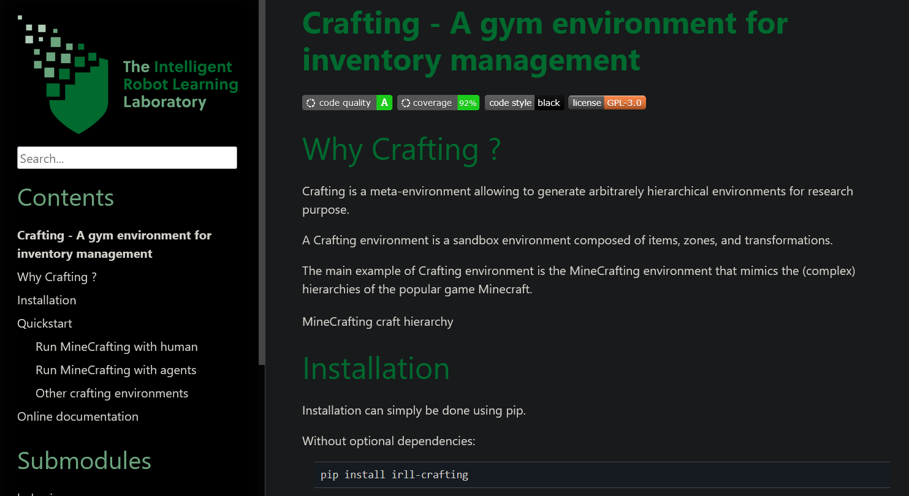

# **Crafting - An environement builder for hierarchical ML research**

[](https://badge.fury.io/py/irll-crafting)
[](https://pepy.tech/project/irll-crafting)
[](https://pepy.tech/project/irll-crafting)
[](https://www.codacy.com/gh/IRLL/Crafting/dashboard?utm_source=github.com&amp;utm_medium=referral&amp;utm_content=IRLL/Crafting&amp;utm_campaign=Badge_Grade)
[](https://www.codacy.com/gh/IRLL/Crafting/dashboard?utm_source=github.com&amp;utm_medium=referral&amp;utm_content=IRLL/Crafting&amp;utm_campaign=Badge_Coverage)
[](https://github.com/psf/black)
[](https://www.gnu.org/licenses/)

# But what is Crafting ?

Crafting is NOT an environment, it's an environment builder.

Crafting allows to generate arbitrarily hierarchical environments for machine learning research purposes.

It uses the classic reinforcement learning framework, the player is in a state and can take actions to update the state.

A Crafting environment is a sandbox environment composed of
items, zones, and transformations.

The main example of Crafting environment is the MineCrafting environment 
that mimics the (complex) hierarchies of the popular game Minecraft.

You can use Crafting to create your own customized environments.
For more examples, see [examples](https://irll.github.io/Crafting/crafting/examples.html).


# Installation

## Using pip.

Without optional dependencies:

```bash
pip install irll-crafting
```

With all optional dependencies:

```bash
pip install irll-crafting[all]
```


All crafting environments can use a common graphical user interface.
With gui requirements:

```bash
pip install irll-crafting[gui]
```

Environment can also be obtained throught the gym interface:
With gym requirements:

```bash
pip install irll-crafting[gym]
```

## Build from source (for contributions)

```bash
git clone https://github.com/IRLL/Crafting.git
```

Install crafting as an editable package
```bash
pip install -e .[all]
```

Install dev requirements
```bash
pip install -r requirements-dev.txt
```

Check installation by running tests
```bash
pytest
```

# Quickstart


## Play MineCrafting yourself! (need gui dependencies)

Using the command line interface:

```bash
crafting minecraft
```

See more options with:

```bash
crafting --help
```

Using the programmatic interface:

```python
from crafting import MineCraftingEnv, get_human_action

env = MineCraftingEnv()
# or env: MineCraftingEnv = gym.make("MineCrafting-NoReward-v1")
n_episodes = 2
for _ in range(n_episodes):
    env.reset()
    done = False
    total_reward = 0
    while not done:
        env.render()
        action = get_human_action(env)
        print(f"Human pressed: {env.world.transformations[action]}")

        _observation, reward, done, _info = env.step(action)
        total_reward += reward

    print(f"SCORE: {total_reward}")
```


## Run MineCrafting with autonomous agents

Using the programmatic interface, any Crafting environment can easily be interfaced with any agent.

```python
import numpy as np
from crafting import MineCraftingEnv

def random_legal_agent(observation, action_is_legal):
    action = np.random.choice(np.nonzero(action_is_legal)[0])
    return action

env = MineCraftingEnv(max_step=10)
done = False
observation = env.reset()
while not done:
    action_is_legal = env.actions_mask
    action = random_legal_agent(observation, action_is_legal)
    _observation, _reward, done, _info = env.step(action)
```
<!-- Run MineCrafting with MaskablePPO from sb3 agent [code] -->

## Other crafting environments

See [`crafting.examples`](https://irll.github.io/Crafting/crafting/examples.html).

``` python
from crafting import TowerCrafting, RecursiveCrafting, RandomCrafting

tower_env = TowerCrafting(height=3, width=2)
# or tower_env = gym.make("TowerCrafting-v1", height=3, width=2)
recursive_env = RecursiveCrafting(n_items=6)
# or recursive_env = gym.make("RecursiveCrafting-v1", n_items=6)
random_env = RandomCrafting(n_items_per_n_inputs={0:2, 1:5, 2:10}, seed=42)
# or random_env = gym.make("RandomCrafting-v1", n_items_per_n_inputs={0:2, 1:5, 2:10}, seed=42)
```

## More about Crafting

### Add a Purpose to the player
See [`crafting.purpose`](https://irll.github.io/Crafting/crafting/purpose.html).

###  Get a solving behavior for any given task
See [`crafting.solving_behaviors`](https://irll.github.io/Crafting/crafting/solving_behaviors.html).

### Details of the environment state
See [`crafting.state`](https://irll.github.io/Crafting/crafting/state.html).

### Plot the underlying requirements graph
See [`crafting.requirements`](https://irll.github.io/Crafting/crafting/requirements.html).

### Create your own customized Crafting environment
See [`crafting.env`](https://irll.github.io/Crafting/crafting/env.html).

Find everything in the [documentation](https://irll.github.io/Crafting/crafting.html):

[](https://irll.github.io/Crafting/crafting.html)

