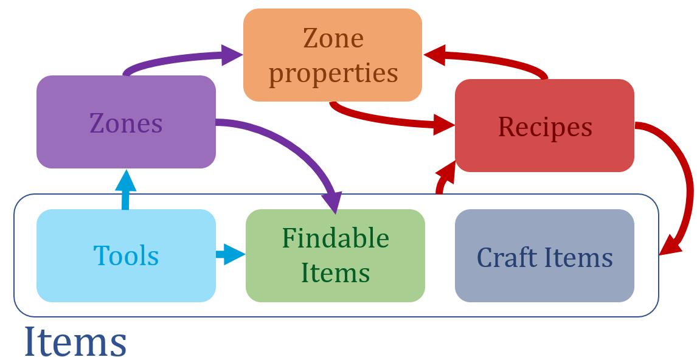

Crafting - A gym environment for inventory management
=====================================================

.. image:: https://app.codacy.com/project/badge/Grade/b5010ccc46274c0eb1e3ae563934efdd
   :alt: [Codacy - grade]
   :target: https://www.codacy.com/gh/IRLL/Crafting/dashboard?utm_source=github.com&amp;utm_medium=referral&amp;utm_content=IRLL/Crafting&amp;utm_campaign=Badge_Grade

.. image:: https://app.codacy.com/project/badge/Coverage/b5010ccc46274c0eb1e3ae563934efdd
   :alt: [Codacy - coverage]
   :target: https://www.codacy.com/gh/IRLL/Crafting/dashboard?utm_source=github.com&amp;utm_medium=referral&amp;utm_content=IRLL/Crafting&amp;utm_campaign=Badge_Coverage

.. image:: https://img.shields.io/badge/code%20style-black-000000.svg
   :alt: [CodeStyle - Black]
   :target: https://github.com/psf/black

.. image:: https://img.shields.io/github/license/MathisFederico/Crafting?style=plastic
   :alt: [Licence - GPLv3]
   :target: https://www.gnu.org/licenses/

Why Crafting ?
--------------

Crafting is a meta-environment allowing to generate 
arbitrarely hierarchical environments for research purpose.

A Crafting environment is a sandbox environment composed of
items, zones, and recipes.
Zones are abstractions of a physical environment
that can be accessed with or without a tool,
they contain findable items that can be gathered with or
without a tool.
Zones have specific properties that can be modified by
the agent.
Recipes are transformations of items to craft new items
or to modify the current zone properties.

Interactions of elements of a Crafting environment can be summarized like this:

The main example of Crafting environment is the MineCrafting environment 
that mimics the craft hierarchy of the popular game Minecraft:

.. figure:: docs/_static/images/minecrafting_crafts_hierarchy.png
   :align: center
   :alt: MineCrafting craft hierarchy

Installation
------------

Using pip:

.. code:: bash

   pip install git+https://github.com/MathisFederico/Crafting.git#egg=crafting

Online documentation
--------------------

.. figure:: docs/_static/images/doc_index.png
   :align: center
   :alt: Online documentation
   :target: https://crafting.readthedocs.io/en/latest/index.html

   Click to see the html documentation!

.. include:: CONTRIBUTING.rst
