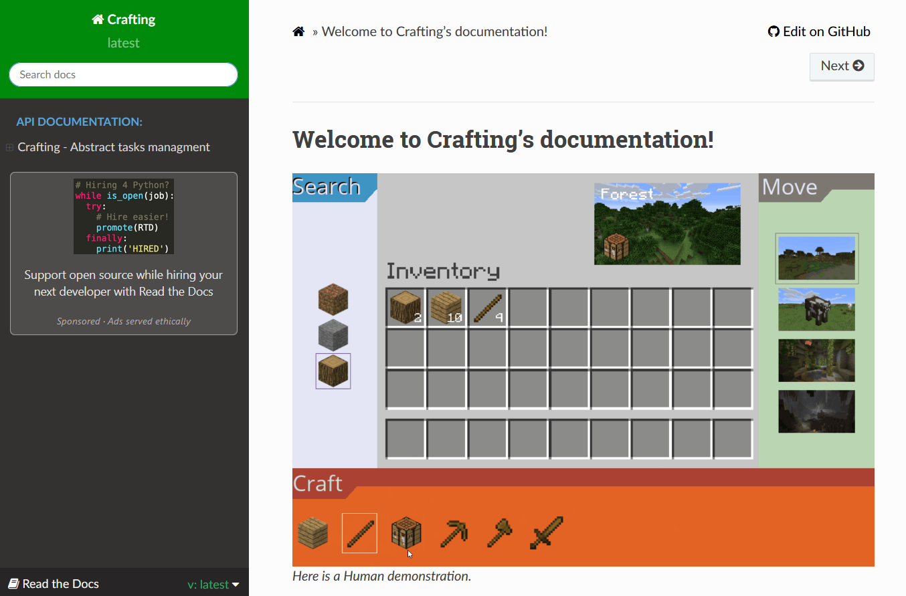

Crafting - A gym environment for inventory management
=====================================================

.. image:: https://app.codacy.com/project/badge/Grade/b5010ccc46274c0eb1e3ae563934efdd
   :alt: [Codacy - grade]
   :target: https://www.codacy.com/gh/IRLL/Crafting/dashboard?utm_source=github.com&amp;utm_medium=referral&amp;utm_content=IRLL/Crafting&amp;utm_campaign=Badge_Grade

.. image:: https://app.codacy.com/project/badge/Coverage/b5010ccc46274c0eb1e3ae563934efdd
   :alt: [Codacy - coverage]
   :target: https://www.codacy.com/gh/IRLL/Crafting/dashboard?utm_source=github.com&amp;utm_medium=referral&amp;utm_content=IRLL/Crafting&amp;utm_campaign=Badge_Coverage

.. image:: https://img.shields.io/badge/code%20style-black-000000.svg
   :alt: [CodeStyle - Black]
   :target: https://github.com/psf/black

.. image:: https://img.shields.io/github/license/MathisFederico/Crafting?style=plastic
   :alt: [Licence - GPLv3]
   :target: https://www.gnu.org/licenses/

Why Crafting ?
--------------

Crafting is a meta-environment allowing to generate 
arbitrarely hierarchical environments for research purpose.

A Crafting environment is a sandbox environment composed of
items, zones, and transformations.

The main example of Crafting environment is the MineCrafting environment 
that mimics the (complex) hierarchies of the popular game Minecraft.

.. figure:: docs/_static/images/minecrafting_crafts_hierarchy.png
   :align: center
   :alt: MineCrafting craft hierarchy

Installation
------------

Installation can simply be done using pip.

Without optional dependencies:

.. code:: bash

   pip install irll-crafting

With all optional dependencies:

.. code:: bash

   pip install irll-crafting[all]

All crafting environments can use a common graphical user interface.
With gui requirements:

.. code:: bash

   pip install irll-crafting[gui]

Environment can also be obtained throught the gym interface:
With gym requirements:

.. code:: bash

   pip install irll-crafting[gym]

Quickstart
----------

Run MineCrafting with human
~~~~~~~~~~~~~~~~~~~~~~~~~~~

Using the command line interface:

.. code:: bash

   python -m crafting.examples.minecraft

Using the programmatic interface:

.. code:: python

    from crafting import MineCraftingEnv, get_human_action

    env = MineCraftingEnv()
    # or env: MineCraftingEnv = gym.make("MineCrafting-NoReward-v1")
    n_episodes = 2
    for _ in range(n_episodes):
        env.reset()
        done = False
        total_reward = 0
        while not done:
            env.render()
            action = get_human_action(env)
            print(f"Human pressed: {env.transformations[action]}")

            _observation, reward, done, _info = env.step(action)
            total_reward += reward

        print(f"SCORE: {total_reward}")

Run MineCrafting with agents
~~~~~~~~~~~~~~~~~~~~~~~~~~~~

Using the programmatic interface, any Crafting environment can easily be interfaced with any agent.

.. code:: python

    import numpy as np
    from crafting import MineCraftingEnv

    def random_legal_agent(observation, action_is_legal):
        action = np.random.choice(np.nonzero(action_is_legal)[0])
        return action

    env = MineCraftingEnv(max_step=10)
    done = False
    observation = env.reset()
    while not done:
        action_is_legal = env.actions_mask
        action = random_legal_agent(observation, action_is_legal)
        _observation, _reward, done, _info = env.step(action)

.. Run MineCrafting with MaskablePPO from sb3 agent [code]

Other crafting environments examples
~~~~~~~~~~~~~~~~~~~~~~~~~~~~~~~~~~~~

.. code:: python

    from crafting import TowerCrafting, RecursiveCrafting, RandomCrafting

    tower_env = TowerCrafting(height=3, width=2)
    # or tower_env = gym.make("TowerCrafting-v1", height=3, width=2)
    recursive_env = RecursiveCrafting(n_items=6)
    # or recursive_env = gym.make("RecursiveCrafting-v1", n_items=6)
    random_env = RandomCrafting(n_items_per_n_inputs={0:2, 1:5, 2:10}, seed=42)
    # or random_env = gym.make("RandomCrafting-v1", n_items_per_n_inputs={0:2, 1:5, 2:10}, seed=42)

Purpose in Crafting
-------------------

Crafting environments are sandbox environments and do not have a precise purpose by default.
But of course, purpose can be added in any Crafting environment by setting up one or multiple tasks.

Tasks can be one of:

* GetItemTask: Get the given item
* GoToZoneTask: Go to the given zone
* PlaceItemTask: Place the given item in the given zone (or any zone if none given).

Single task purpose
~~~~~~~~~~~~~~~~~~~

When a single task is passed to a Crafting environment, it will automaticaly build a purpose.
Then the environment will terminates if the task is completed.

.. code:: python

    from crafting import MineCraftingEnv
    from crafting.purpose import GetItemTask
    from crafting.examples.minecraft.items import DIAMOND

    get_diamond = GetItemTask(DIAMOND, reward=10)
    env = MineCraftingEnv(purpose=get_diamond)

Reward shaping
~~~~~~~~~~~~~~

Achievement tasks only rewards the player when completed. But this long term feedback is known 
to be challenging. To ease learning such tasks, Crafting Purpose can generate substasks to give 
intermediate feedback, this process is also known as reward shaping.

Reward shaping can be one of:

* "none": No reward shaping
* "all": All items and zones will be associated with an achievement subtask.
* "required": All (recursively) required items and zones for the given task will be associated with an achievement subtask.
* "inputs": Items and zones consumed by any transformation solving the task will be associated with an achievement subtask.

For example, let's add the "required" reward shaping to out get_diamond task:

.. code:: python

    from crafting import MineCraftingEnv
    from crafting.purpose import Purpose, GetItemTask
    from crafting.examples.minecraft.items import DIAMOND

    get_diamond = GetItemTask(DIAMOND, reward=10)
    purpose = Purpose()
    purpose.add_task(get_diamond, reward_shaping="required")

    env = MineCraftingEnv(purpose=purpose)

Multi-tasks and terminal groups
~~~~~~~~~~~~~~~~~~~~~~~~~~~~~~~

In a sandbox environment, why limit ourselves to only one task ?
In crafting, a purpose can be composed on multiple tasks.
But then the question arise: "When does the purpose terminates ?".
When any task is done ? When all tasks are done ?

To solve this, we need to introduce terminal groups.
Terminal groups are represented with strings.

The purpose will termitate if ANY of the terminal groups have ALL its tasks done.

When adding a task to a purpose, one can choose one or multiple terminal groups like so:

.. code:: python

    from crafting import MineCraftingEnv
    from crafting.purpose import Purpose, GetItemTask, GoToZone
    from crafting.examples.minecraft.items import DIAMOND, GOLD_INGOT, EGG
    from crafting.examples.minecraft.zones import END

    get_diamond = GetItemTask(DIAMOND, reward=10)
    get_gold = GetItemTask(GOLD_INGOT, reward=5)
    get_egg = GetItemTask(EGG, reward=100)
    go_to_end = GoToZone(END, reward=20)

    purpose = Purpose()
    purpose.add_task(get_diamond, reward_shaping="required", terminal_groups="get rich!")
    purpose.add_task(get_gold, terminal_groups=["golden end", "get rich!"])
    purpose.add_task(go_to_end, reward_shaping="inputs", terminal_groups="golden end")
    purpose.add_task(get_egg, terminal_groups=None)

    env = MineCraftingEnv(purpose=purpose)

Here the environment will terminate if the player gets both diamond and gold_ingot items ("get rich!" group) 
or if the player gets a gold_ingot and reaches the end zone ("golden end" group).
The task get_egg is optional and cannot terminate the purpose anyhow, but it will still rewards the player if completed.

Just like this last task, reward shaping subtasks are always optional.

.. ## Rendering options

.. ## Requirements graphs

.. ## Solving behavior
.. Install HEBG [bash]

.. Solve MineCrafting [code]
.. Plot rolled / unrolled [wooden pickaxe]
.. Generated code

.. Solve RandomCrafting [code]
.. Plot rolled / unrolled
.. Generated code

Online documentation
--------------------

   Click to see the html documentation!

.. include:: CONTRIBUTING.rst
