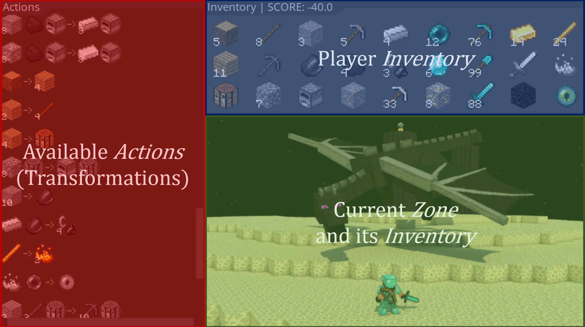

# Summary
Hierarchical reasoning is a fundamental challenge in artificial intelligence. Current methods may fail in the face of hierachical tasks but there are few environments or environment builders designed to understand how the depth and width of hierarchices affect task difficulty. Our software was built as an important first tooling step towards research questions around AI and hierarchical reasoning.

We introduce **HierarchyCraft**, lightweight environment builder for arbitrary hierarchical reasoning tasks that do not require feature extraction --- there are not pixel images, text, sound or anything requiring feature extraction or representation to be learned. HierarchyCraft both provides a set of environments for experimenting with hierarchical AI algorithms, but also and makes it easy to build custom hierarchical environments.

For example, Minecraft has been studied due to its popularity and its deep hierarchical structure, but the 3D environment requires complex feature extraction and pixel-level processing [@dreamerv3]. In contrast HierarchyCraft can recreate the hierarchical complex task without requiring a an agent to reason at the pixel level. A view of the graphical interface common to all HierarchyCraft environments is shown in \autoref{fig:MineHcraft-dragon}, but pictures and icons are only available on the human interface for illustration purpose and are not seen by the agent.

# Statement of need
HierarchyCraft is designed to be an easy to use Python library to build environments that can be used to study hierarchical reasoning in the contexts of reinforcement learning, classical planning, and program synthesis as displayed in \autoref{fig:HierachyCraft_domain_position}.

{ width=80% }

Studying and quantifying the effects of different hierarchical structures on learning agents should be a priority for hierarchical reasoning.
Yet current hierarchical benchmarks mostly consider one single hierarchical structure per benchmark and are not only challenging because of this underlying hierarchical structure but also because of the required representation learning to make sense of the inputs.

We argue that arbitrary hierarchical complexity can emerge from simple rules even without having to learn a representation.
To our knowledge, no general frameworks for building environments exist to study the hierarchical structure itself, motivating the need for HierarchyCraft.
We compare five particularly related benchmarks to HierarchyCraft.

### PDDLGym

PDDLGym [@PDDLgym] is a framework that automatically constructs Gym environments from Planning Domain Definition Language (PDDL) domains and problems. PDDL [@PDDL] is a problem specification language for easy comparison of various symbolic planners. However, building PDDL domains and problems with a hierarchical structure is difficult and time-consuming for researchers who are not familiar with PDDL-like languages. Moreover, PDDLGym is **only compatible with PDDL1** and does not support numeric-fluents introduced in PDDL 2.1 that are required to represent HierarchyCraft environments.

### Minecraft

One of the best examples of a hierarchical tasks is the collection of diamonds in the popular video game Minecraft as illustrated by the MineRL competition [@guss2021minerl2020] where hierarchical reinforcement learning agents have dominated the leaderboard [@milani2020minerl2019].

Due to the sparse rewards, exploration difficulty, and long time horizons in this procedurally generated sandbox environment, DreamerV3 [@dreamerv3] only recently became the first algorithm to successfully collect diamonds in Minecraft from scratch.
Unfortunately, DreamerV3 needed to be trained on Nvidia V100 GPU for 17 days, gathering around 100 million environmental steps.
Such **tremendous computational resources** are not accessible to most researchers, slowing the general progress of research on hierarchical reasoning.

Moreover, even tought Minecraft has a undeniable complex hierarchical structure as shown in \autoref{fig:MinecraftRequirements}, those hierarchical structures are fixed and cannot be modified without modding the game which is complex for researchers to do.

![Example of Minecraft tasks fixed hierarchical structure.[@guss2021minerl2020]\label{fig:MinecraftRequirements}](docs/images/MineRLCompetitionRequirementsGraph.png){ width=80% }

### Crafter

Crafter [@hafner2022benchmarking] is a lightweight grid-based 2D environment, with similar game mechanics as Minecraft and poses substantial challenges including exploration, representation learning, rewards sparsity and long-term reasoning.
Even tough Crafter provides 22 different tasks displayed in \autoref{fig:CrafterRequirements}, the relation between them and thus **the underlying hierarchical structure of the environment is fixed** limiting how researchers can study the effects of changes in this structure.
Moreover, the 22 tasks considered by the authors do not contain navigation subtasks (Find water, look for a cow, wait for plant to grow, go back to a table, ...) or some optional subtasks (Swords makes killing skeletons easier) that causes sudden drops of success rates in the hierarchy instead of a more incremental difficulty.

![Partial Hierarchical structure of the Crafter environment. Inspired from Figure 4 of [@hafner2022benchmarking]\label{fig:CrafterRequirements}](docs/images/CrafterRequirementsGraph.png){ width=100% }

### GridWorld

GridWorld is a general class of 2D grid-based environments. It is frequently facilitated in hierarchical reinforcement learning research, such as in the options framework [@sutton1999between]. Minigrid [@minigrid] allows researchers to build more complex cases and can be somewhat hierarchical by adding more rooms, objectives or obstacles as shown in \autoref{fig:MinigridHierarchies}. Unfortunately, GridWorld environments usually describe **shallow** hierarchical structure and are only focused on navigation tasks.

{ width=100% }

<!-- ### NetHack Learning Environment

The NetHack learning environment [@kuttler2020nethack] is based on the game NetHack, where the observation is a grid composed of hundreds of possible symbols.
Large numbers of items are randomly placed in each level, making NetHack extremely complex and challenging. In fact, NetHack is **too complex for agents to learn**, it requires many environment steps for agents to acquire domain-specific knowledge. 10B steps were required for the NeurIPS 2021 NetHack challenge [@2021NetHack], making it impractically long for a benchmark. Moreover, the NetHack game also has a **fixed underlying hierarchy** that cannot be easily modified. -->

### Arcade Learning Environment (Atari)

The arcade learning environment [@ALE] is one of the standard benchmarks in RL and is composed of over 55 Atari games over but **only a few games of these games require hierarchical reasoning** (e.g., Montezuma's Revenge and Pitfall). Each Atari games has a fixed hierarchy that cannot be modified and agents **require powerful computational resources** to extract relevant features from pixels, which substantially slow down experiments.

## Design goals

HierarchyCraft aims to be a fruitful tool for studying hierarchical reasoning by focusing on the following four design goals.

### 1. Hierarchical by design
The action space can be composed of sub-tasks (i.e. _Transformations_) instead of detailed movements and controls. Any behaviour can be naturally decomposed into _Transformations_, rendering HierarchyCraft environments hierarchical by nature.

This is further illustrated by the hierarchical structure of HierarchyCraft environments as a _requirements graph_ that can be directly built from the list of _Transformations_ composing the environement as shown in \autoref{fig:TransformationToRequirements}.

Requirements graphs are to be seen as a generalisation of graph pictures from related works such as \autoref{fig:MinecraftRequirements}, \autoref{fig:CrafterRequirements} and \autoref{fig:MinigridHierarchies}.

{ width=60% }

### 2. No feature extraction needed
Compared to benchmarks that return grids, pixel arrays, text, or sound, HierarchyCraft directly return a low-dimensional latent representation that does not need to be learned as represented in \autoref{fig:HierarchyCraftState}.
This saves compute time and allow researchers to focus on the hierarchical reasoning while also permitting the use of classical planning frameworks like PDDL [@PDDL] or ANML [@ANML].

{ width=80% }

### 3. Easy to use and customize
HierarchyCraft is a generic framework facilitating the creation of diverse hierarchical environments.
The library is simple and flexible, enabling researchers to define their own hierarchical environments. A detailed creation of an environment is provided in the documentation.
To showcase the diversity of environments that can be created within HierarchyCraft, multiple environments are provided as examples.

### 4. Compatible with domains frameworks
HierarchyCraft environments are directly compatible with both reinforcement learning through OpenAI Gym [@gym] and planning through the Unified Planning Framework [@UPF] (see \autoref{fig:HierarchyCraft-pipeline}). Compatibility with both frameworks makes it easy to be used by both the reinforcement learning and planning communities.

{ width=100% }

# Acknowledgements

This work was made possible by the research program of the engineering cursus at CentraleSupelec, University of Paris-Saclay, France.

This work has taken place in the Intelligent Robot Learning (IRL) Lab at the University of Alberta, which is supported in part by research grants from the Alberta Machine Intelligence Institute (Amii); a Canada CIFAR AI Chair, Amii; Compute Canada; Huawei; Mitacs; and NSERC.

We would like to thank Shang Wang, Yuxuan Li and Laura Petrich from the IRL Lab for their help on finding and describing related works, for their critical thinking on the project and for revisions of the documentation and report.

# References
