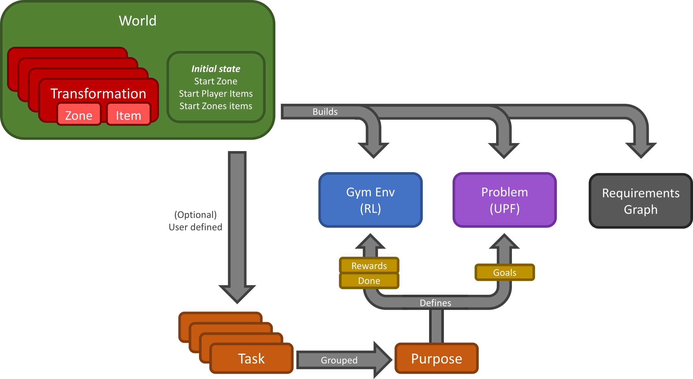
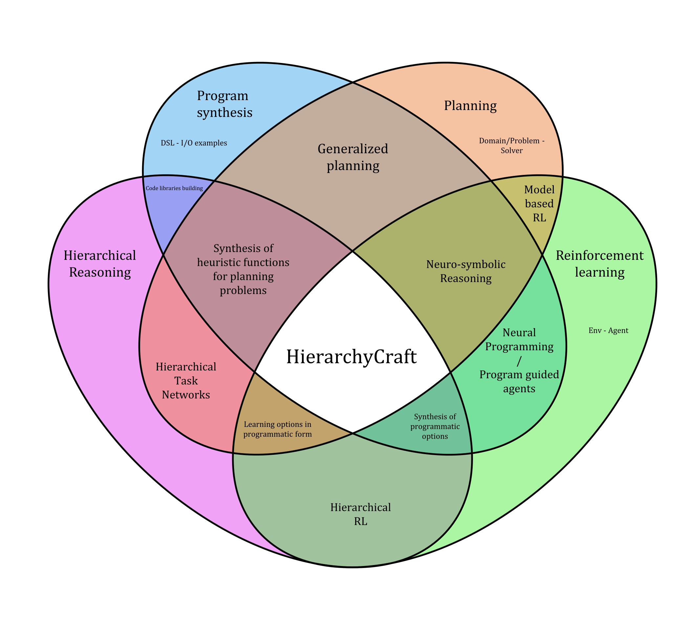

# Summary
Hierarchical reasoning is a fundamental challenge in artificial intelligence. Current methods may fail in the face of hierachical tasks but no metrics exist to properly quantify *how hierarchical* a task is. Existing environments only allow for few specific hierarchies to be tested and rely on non-trivial feature extractions requiring heavy computational resources.

We introduce **HierarchyCraft**, lightweight environment builder for arbitrary hierarchical reasoning tasks without feature, that is without grids, pixel images, text, sound or anything requiring feature extraction or representation to be learned. HierarchyCraft both provides a set of environments for experimenting with hierarchical AI algorithms, but also and makes it easy to build custom hierarchical environments.

For example, Minecraft has been studied due to its popularity and its deep hierarchical structure, but the 3D environment requires complex feature extraction and pixel-level processing [@dreamerv3]. In contrast HierarchyCraft can recreate the hierarchical complex task without requiring a an agent to reason at the pixel level. A view of the graphical interface common to all HierarchyCraft environments is shown in Figure \autoref{fig:MineHcraft-dragon}, but pictures and icons are only available on the human interface for illustration purpose and are not seen by the agent.

## Design goals

HierarchyCraft aims to be a fruitful tool for studying hierarchical reasoning by focusing on the following four design goals.

### 1. Hierarchical by design
The action space can be composed of sub-tasks instead of detailed movements and controls. Any behaviour can be naturally decomposed into sub-tasks, rendering HierarchyCraft environments hierarchical by nature.

### 2. No feature extraction needed
Compared to benchmarks that return grids, pixel arrays, text, or sound, HierarchyCraft directly return a low-dimensional latent representation that does not need to be learned.
This saves compute time and allow researchers to focus on the hierarchical reasoning while also permitting the use of classical planning frameworks like PDDL [@PDDL] or ANML [@ANML].

### 3. Easy to use and customize
HierarchyCraft is a generic framework facilitating the creation of diverse hierarchical environments.
The library is simple and flexible, enableing researchers to define their own hierarchical environments. A detailed creation of an environment is provided in the documentation.
To showcase the diversity of environments that can be created within HierarchyCraft, multiple environment examples are provided.

### 4. Compatible with domains frameworks
HierarchyCraft environments are directly compatible with both reinforcement learning via OpenAI Gym [@gym] and planning via the Unified Planning Framework [@UPF] via PDDL [@PDDL] (see Figure \autoref{fig:HierarchyCraft-pipeline}). Compatibility with both frameworks makes it easy to be used by both the reinforcement learning and planning communities.

# Statement of need
HierarchyCraft is designed to be an easy to use Python library to build environments that can be used to study hierarchical reasoning in the contexts of reinforcement learning, classical planning, and program synthesis as displayed in Figure \autoref{fig:HierachyCraft_domain_position}.

{ width=80% }

We argue that arbitrary hierarchical complexity can emerge from simple rules, yet no metric exists to quantify this phenomenon. Studying and quantifying the effects of different hierarchical structures on learning agents should be a priority for hierarchical reasoning. Unfortunately, existing RL benchmarks considered hierarchical are not only challenging because of their underlying hierarchical structure but also because of the feature extraction and representation learning required. To our knowledge, no general frameworks for building environments to study the hierarchical structure itself exist, motivating the need for HierarchyCraft.

## Related works

Most of recent hierarchical RL environments require researchers to have significant computational resources at hand and only tests the agent under a singular fixed hierarchy. This limits their ability to study the direct impact of the underlying hierarchical structure of the environment on the learning agent. We compare seven particularly related benchmarks to HierarchyCraft.

### Minecraft

One of the best examples of a hierarchical tasks is the collection of diamonds in the popular video game Minecraft as illustrated by the MineRL [@milani2020minerl].
Inspired by the historically well-selling video game Minecraft, several pioneers have developed and challenged learning Minecraft-like environments, such as the MineRL competition [@guss2021minerl] and Malmo [@johnson2016malmo].

Due to the sparse rewards, exploration difficulty, and long time horizons in this procedurally generated sandbox environment, DreamerV3 [@dreamerv3] on recently became the first algorithm to successfully collect diamonds in Minecraft from scratch.
Unfortunately, DreamerV3 needs to be trained on Nvidia V100 GPU for 17 days, gathering around 100 million environmental steps.
Such **tremendous computational resources** are not accessible to most researchers, slowing the general progress of research on hierarchical reasoning.

### Crafter

Crafter [@hafner2021benchmarking] is a lightweight grid-based 2D environment, with similar game mechanics as Minecraft and poses substantial challenges including exploration, representation learning, rewards sparsity and long-term reasoning.
Even tough Crafter indicates 22 achievements mapping to 22 different tasks (e.g., “collect stone” and “place stone”), the relation between items is fixed and thus **the underlying hierarchical structure of the environment is fixed**, limiting how researchers can study the effects of changes in this structure.

### GridWorld

GridWorld is a general class of 2D grid-based environments. It is frequently facilitated in hierarchical reinforcement learning research, such as in the options framework [@sutton1999between]. Minigrid [@minigrid] allows researchers to build more complex cases and can be somewhat hierarchical by adding more rooms and keys, or obstacles like lava. Unfortunately, GridWorld environments can only describe **shallow and fixed hierarchies**.

### Arcade Learning Environment (Atari)

The arcade learning environment [@ALE] is one of the standard benchmarks in RL and is composed of over 55 Atari games. Similar to the Minecraft benchmark, atari games **require powerful computational resources**, which substantially slow down experiments.
Moreover, **only a few games of these games require hierarchical reasoning** (e.g., Montezuma's Revenge and Pitfall). Similar to MineRL, the agent still needs extra computational cost to extract the features from pixels. Similar to Crafter, each Atari games has a fixed hierarchies that cannot be modified.

### NetHack Learning Environment

The NetHack learning environment [@kuttler2020nethack] is based on the game NetHack, where the observation is a grid composed of hundreds of possible symbols.
Large numbers of items are randomly placed in each level, making NetHack extremely complex and challenging. In fact, NetHack is **too complex for agents to learn**, it requires many environment steps for agents to acquire domain-specific knowledge. 10B steps were required for the NeurIPS 2021 NetHack challenge [@hafner2021benchmarking], making it impractically long for a benchmark. Moreover, the NetHack game has only a **fixed underlying hierarchy** that cannot be easily modified.

### DeepMind Lab

DeepMind lab [@deepmindlab] is a first-person 3D game platform designed for AI research. Agents can learn in complex tasks with partial observability and visually diverse worlds. While providing flexible API to allow users design new tasks, DeepMind lab **requires feature extraction** from images, preventing it to be represented in planning frameworks like most of the other previously described works.

### PDDLGym

PDDLGym [@PDDLgym] is a framework that automatically constructs Gym environments from Planning Domain Definition Language (PDDL) domains and problems. PDDL [@PDDL] is a problem specification language for easy comparison of various symbolic planners in the AI planning community. PDDLGym offers a compact symbolic language for describing domains, which facilitates the creation of numerous, diverse benchmarks for sequential decision-making. However, in PDDLGym, actions space are detailed templates grounded with objects (e.g., $pick(plate)$). Building from such detailed templates makes it **difficult to use for creating hierarchical environments** specifically and time-consuming for researchers who are not familiar with PDDL-like languages. Moreover, PDDLGym is **only compatible with PDDL1** and does not suppoert `numeric-fluents` introduced in PDDL 2.1 that are required to represent HierarchyCraft environments.

# Acknowledgements

This work was made possible by the research program of the engineering cursus at CentraleSupelec, University of Paris-Saclay, France.

This work has taken place in the Intelligent Robot Learning (IRL) Lab at the University of Alberta, which is supported in part by research grants from the Alberta Machine Intelligence Institute (Amii); a Canada CIFAR AI Chair, Amii; Compute Canada; Huawei; Mitacs; and NSERC.

We would like to thank Shang Wang, Yuxuan Li and Laura Petrich from the IRL Lab for their help on finding and describing related works, for their critical thinking on the project and for revisions of the documentation and report.

# References
