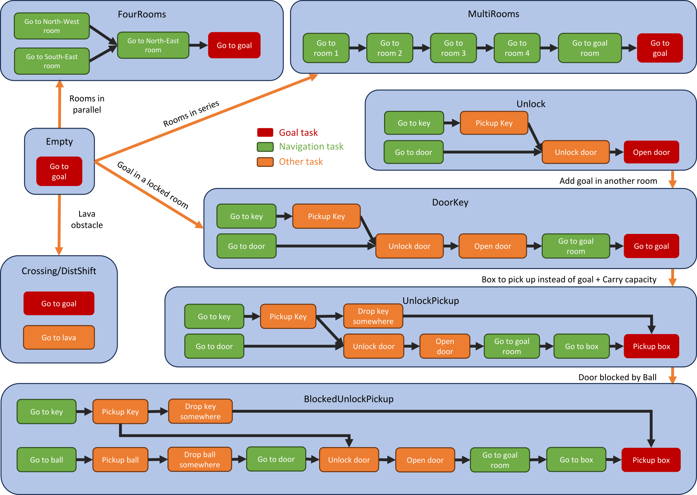

# Summary

Hierarchical reasoning poses a fundamental challenge in the field of artificial intelligence [@botvinick2014model]. Existing methods may struggle when confronted with hierarchical tasks [@bacon2017option,@heess2016learning,@nachum2018data], yet despite the importance of understanding how the structure of an underlying hierarchy affects task difficulty, there is a lack of suitable environments or benchmarks to facilitate this exploration.

We introduce **HierarchyCraft** a software package that enables reasearchers to create custom environments based only on their hierarchical structures. This represents an important first step in developing tools for studying hierarchical reasoning and .

**HierarchyCraft** excludes unstructured data, such as pixel images, text, sound, or other data types typically processed using deep learning techniques, for two key reasons. First, this focus allows researchers to isolate and study hierarchical behavior without the complexity introduced by feature extraction, which is straightforward in this context compared to most reinforcement learning environments. The primary source of difficulty lies in the hierarchical structure of the actions to be performed. Second, by excluding these data types, HierarchyCraft ensures that the environments are well-suited for classical planning algorithms, enabling meaningful comparisons between hierarchical decision-making in classical planning and reinforcement learning.

HierarchyCraft serves a dual purpose by offering a set of pre-defined hierarchical environments and simplifying the process of creating customized hierarchical environments.

{ width=75% }

# Statement of need

HierarchyCraft is designed as a user-friendly Python library for constructing environments tailored to the study of hierarchical reasoning  in the contexts of reinforcement learning, classical planning, and program synthesis as displayed in \autoref{fig:HierachyCraft_domain_position}.

Analysis and quantification of the impacts of diverse hierarchical structures on learning agents is essential for advancing hierarchical reasoning.
However, current hierarchical benchmarks often limit themselves to a single hierarchical structure per benchmark, and present challenges not only due to this inherent hierarchical structure but also because of the necessary representation learning to interpret the inputs.

HierarchyCraft is not a benchmark itself, but a benchmark builder 
designed to facilitate the study of how different hierarchical structures influence 
the performance of classical planners and reinforcement learning algorithms. 
It includes several 
[examples](https://github.com/IRLL/HierarchyCraft/tree/master/src/hcraft/examples), 
detailed in 
[the package documentation](https://irll.github.io/HierarchyCraft/hcraft/examples),
that can serve as initial benchmarks — those example includes basic parametrised hierarchical structure builders (Random, Recursive, Tower), and fixed one imitating other environments (MineHCraft imitating Minecraft tasks, MiniHCraft imitating Minigrid tasks).
However, researchers are encouraged to create their own custom hierarchical environments to further explore hierarchical structures of their choice.

We argue that arbitrary hierarchical complexity can emerge from simple rules without the need for learning a representation.
To the best of our knowledge, no general frameworks currently exist for constructing environments dedicated to studying the hierarchical structure itself. We next highlight five related benchmarks, underscoring the necessity for the development of a tool like HierarchyCraft.

### GridWorld

GridWorld, a general class of 2D grid-based environments, is frequently utilized in hierarchical reinforcement learning research, notably within the options framework [@sutton1999between].

Minigrid [@minigrid] is a user-friendly Python library that not only implements a GridWorld engine but also expands its capabilities. This allows researchers to create more intricate scenarios by introducing additional rooms, objectives, or obstacles, as illustrated in  \autoref{fig:MinigridHierarchies}. Unfortunately, GridWorld environments typically exhibit a **limited hierarchical structure** and primarily focus on navigation tasks.

{ width=100% }

### Minecraft

An exemplary instance of a hierarchical task is the collection of diamonds in the popular video game Minecraft, as showcased in the MineRL competition [@guss2021minerl2020], where hierarchical reinforcement learning agents have dominated the leaderboard[@milani2020minerl2019].
Due to sparse rewards, the difficulty of exploration, and long time horizons in this procedurally generated sandbox environment, DreamerV3 [@dreamerv3] recently became the first algorithm to successfully collect diamonds in Minecraft without prior training or knowledge.
Unfortunately, DreamerV3 required training on an Nvidia V100 GPU for 17 days, gathering roughly 100 million environmental steps.
Such **substantial computational resources are unavailable to many researchers**, impeding the overall progress of research on hierarchical reasoning.
Moreover, although Minecraft has an undeniably complex hierarchical structure, **this underlying hierarchical structure is fixed** and cannot be modified without modding the game, a complex task for researchers.

### Crafter

Crafter [@hafner2022benchmarking] presents a lightweight grid-based 2D environment, with game mechanics akin to Minecraft and poses similar challenges including exploration, representation learning, rewards sparsity and long-term reasoning.
Although Crafter offers 22 different tasks displayed in \autoref{fig:CrafterRequirements}, the **underlying hierarchical structure is fixed**, restricting how researchers can investigate the impacts of changes to the hirerachy.
Moreover, the tasks considered by the authors do not encompass various navigation-related subtasks (such as finding water, locating a cow, waiting for a plant to grow, or returning to a table), nor do they include certain optional but beneficial subtasks (for example, using swords or the skill of dodging arrows can make the task of defeating skeletons easier).

This omission results in abrupt drops in success rates within the hierarchy, rather than a more gradual progression in difficulty. This highlights that the hierarchy presented by the authors is incomplete, as it fails to capture the full range of subtasks in Crafter and the necessary or helpful interactions between them for successfully completing higher-level tasks.
![Hierarchical structure of the Crafter environment as presented by the authors of Crafting with their success rates. Inspired from Figure 4 of [@hafner2022benchmarking]\label{fig:CrafterRequirements}](docs/images/CrafterRequirementsGraph.png){ width=80% }

### PDDLGym

PDDLGym [@PDDLgym] is a Python library that automatically constructs Gym environments from Planning Domain Definition Language (PDDL) domains and problems. PDDL [@PDDL] functions as a problem specification language, facilitating the comparison of different symbolic planners. However, constructing PDDL domains and problems with a hierarchical structure is challenging and time-consuming, especially for researchers unfamiliar with PDDL-like languages.
Additionally, PDDLGym is **compatible only with PDDL1** and does not support numeric-fluents introduced in PDDL 2.1 that are required to represent quantities in the inventories of HierarchyCraft environments.

<!-- ### NetHack Learning Environment

The NetHack learning environment [@kuttler2020nethack] is based on the game NetHack, where the observation is a grid composed of hundreds of possible symbols.
Large numbers of items are randomly placed in each level, making NetHack extremely complex and challenging. In fact, NetHack is **too complex for agents to learn**, it requires many environment steps for agents to acquire domain-specific knowledge. 10B steps were required for the NeurIPS 2021 NetHack challenge [@2021NetHack], making it impractically long for a benchmark. Moreover, the NetHack game also has a **fixed underlying hierarchy** that cannot be easily modified. -->

### Arcade Learning Environment (Atari)
The arcade learning environment [@ALE] stands as a standard benchmark in reinforcement learning, encompassing over 55 Atari games. However, **only a few of these games, such as Montezuma’s Revenge and Pitfall, necessitate hierarchical reasoning**. Each Atari games has a **fixed hierarchy that cannot be modified** and agents **demand substantial computational resources** to extract relevant features from pixels or memory, significantly slowing down experiments.

## Design goals

HierarchyCraft aims to be a fruitful tool for investigating hierarchical reasoning, focusing on achieving the following four design goals.

### 1. Hierarchical by design

The action space of HierarchyCraft environments consists of sub-tasks, referred to as *Transformations*, as opposed to detailed movements and controls. But each of *Transformations* has specific requirements to be valid (e.g. have enough of an item, be in the right place), and these requirements may necessitate the execution of other *Transformations* first, inherently creating a hierarchical structure in HierarchyCraft environments.
This concept  is visually represented by the _Requirements graph_ depicting the hierarchical relationships within each HierarchyCraft environment.
The _Requirements graph_ is directly constructed from the list of *Transformations* composing the environement, as illustrated in \autoref{fig:TransformationToRequirements}.
Requirements graphs should be viewed as a generalization of previously observed graphical representations from related works, including  \autoref{fig:CrafterRequirements} and \autoref{fig:MinigridHierarchies}.

{ width=75% }

### 2. No feature extraction needed

In contrast to benchmarks that yield grids, pixel arrays, text, or sound, HierarchyCraft directly provides a low-dimensional representation that does not require the further features extraction, as depicted in Figure \autoref{fig:HierarchyCraftState}.
This not only saves computational time but also enables researchers to concentrate on hierarchical reasoning, allow the use of classical planning frameworks such as PDDL [@PDDL] or ANML [@ANML], and enables the creation of any arbitrary complex custom environment from a list of *Transformation*, nothing more.
{ width=80% }

### 3. Easy to use and customize

HierarchyCraft is a versatile framework enabling the creation of diverse hierarchical environments.
The library is designed to be simple and flexible, allowing researchers to define their own hierarchical environments with detailed guidance provided in the documentation.
To showcase the range of environments possible within HierarchyCraft, multiple examples are provided.

### 4. Compatible with multiple frameworks

HierarchyCraft environments are directly compatible with both reinforcement learning through OpenAI Gym [@gym] and planning through the Unified Planning Framework [@UPF] (see \autoref{fig:HierarchyCraft-pipeline}).
This compatibility facilitates usage by both the reinforcement learning and planning communities.

{ width=80% }

# Acknowledgements

This work was made possible by the research program of the engineering cursus at CentraleSupelec, University of Paris-Saclay, France.

The research was conducted at the Intelligent Robot Learning (IRL) Lab, University of Alberta, which is supported in part by research grants from the Alberta Machine Intelligence Institute (Amii); a Canada CIFAR AI Chair, Amii; Compute Canada; Huawei; Mitacs; and NSERC.

Special thanks to Laura Petrich and other members of the IRL Lab for there assistance in finding and describing related works, their critical thinking on the project, and their contributions to the revisions of the documentation and report.

# References
